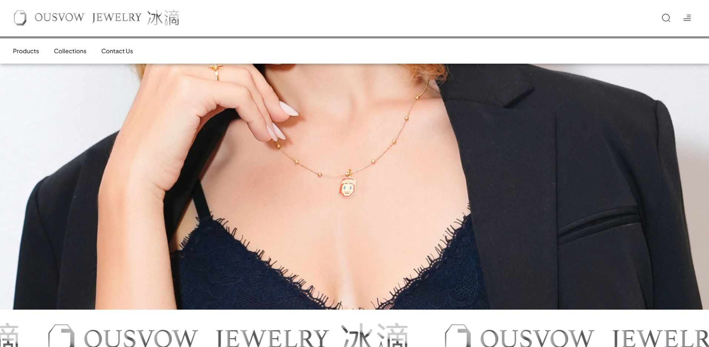
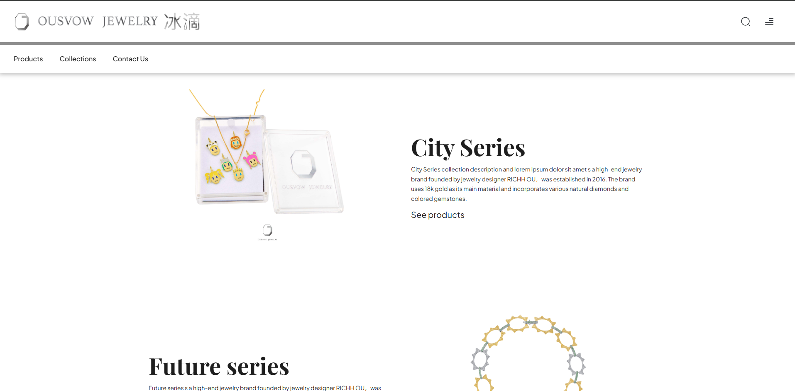
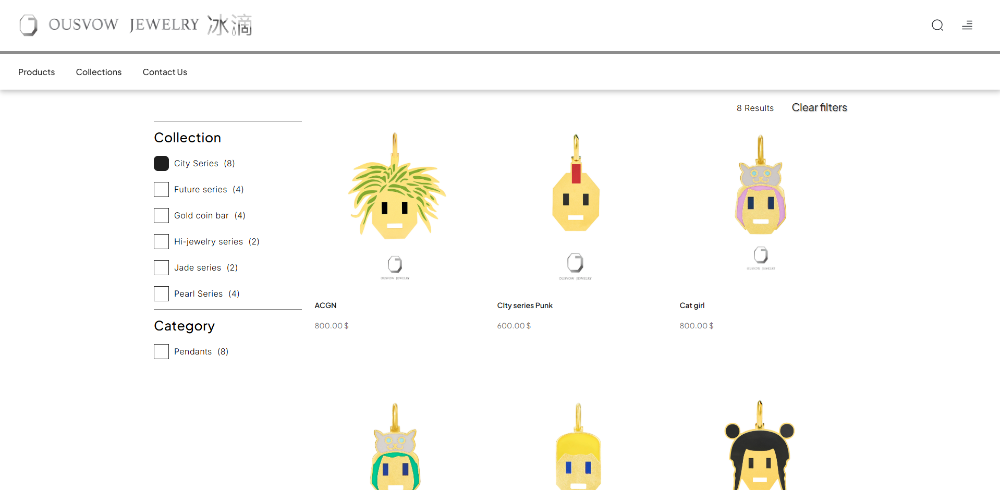
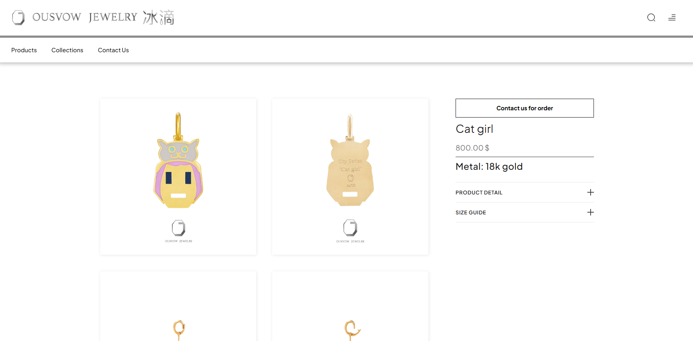

# OUSVOW Jewelry — E-Commerce Platform


Premium e-commerce catalog for **OUSVOW Jewelry**, a luxury jewelry brand known for avant-garde aesthetics and its use of 18k gold, natural diamonds, and colored gemstones.

🔗 **Live:** [ousvowjewelry.com](https://ousvowjewelry.com)

Developed end-to-end (backend, architecture, infrastructure, deployment) at [DAKER Studio](https://daker.site).

---

## Overview

A catalog platform built to reflect the brand's craftsmanship and distinctive design philosophy. It presents collections, categories, and individual products with a responsive layout and automated image optimization, backed by a custom admin for content and order management.

## Key Features

- **Collections & categories** — products organized across collections and global categories with faceted filtering
- **Automated image optimization** — every uploaded product image generates responsive `webp` and `jpg` variants (350w / 525w) on save, via a Pillow pipeline
- **Configurable landing page** — featured products and a curated 3-item block managed from the admin
- **Product detail with similar items** — related products surfaced by shared collection and category
- **Custom admin** — content and order management built on Django admin

## Tech Stack

| Layer | Technology |
|-------|-----------|
| Backend | Python 3.13, Django 6.1 |
| Database | SQLite |
| Frontend | Django Templates, SCSS, responsive layout |
| Images | Pillow (responsive webp/jpg variant generation) |
| Deployment | Docker, Gunicorn, Nginx, VPS |
| Quality | Ruff (linting), GitHub Actions (CI) |

## Architecture Highlights

- **Image variant pipeline** — a `post_save` signal generates optimized responsive variants for each product image, keeping page weight low without manual work
- **Faceted catalog filtering** — collection and category filters with live product counts per facet
- **Abstract base model** — shared `created_at` / `updated_at` timestamps via a `TimestampedModel`
- **Auto-slugging** — collections, categories, and products slug themselves from their names on save

## Code Quality & CI

Every push runs an automated pipeline via GitHub Actions:

- **Ruff** — linting and import sorting
- **Django system checks** — project integrity validation
- **Test suite** — 17 tests covering models, views, image generation, and catalog filtering

## Running Locally

```bash
git clone https://github.com/dakerdenis/jewelry_catalog.git
cd jewelry_catalog/jewelry_shop

cp .env.example .env        # then fill in your values

# With Docker
docker compose up --build

# Or manually
python -m venv .venv
source .venv/bin/activate    # Windows: .venv\Scripts\activate
pip install -r requirements.txt
python manage.py migrate
python manage.py runserver
```

## Screenshots

### Landing


### Collections


### Catalog


### Product


---

<sub>Built by [Denis Akershteyn](https://www.linkedin.com/in/denis-akershteyn) · [DAKER Studio](https://daker.site)</sub>